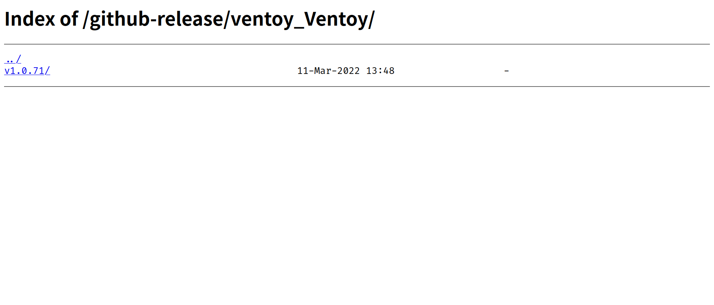
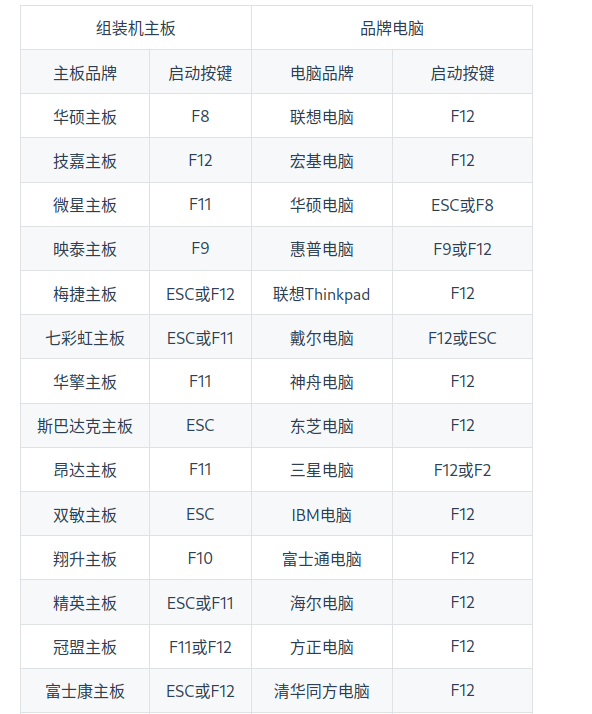
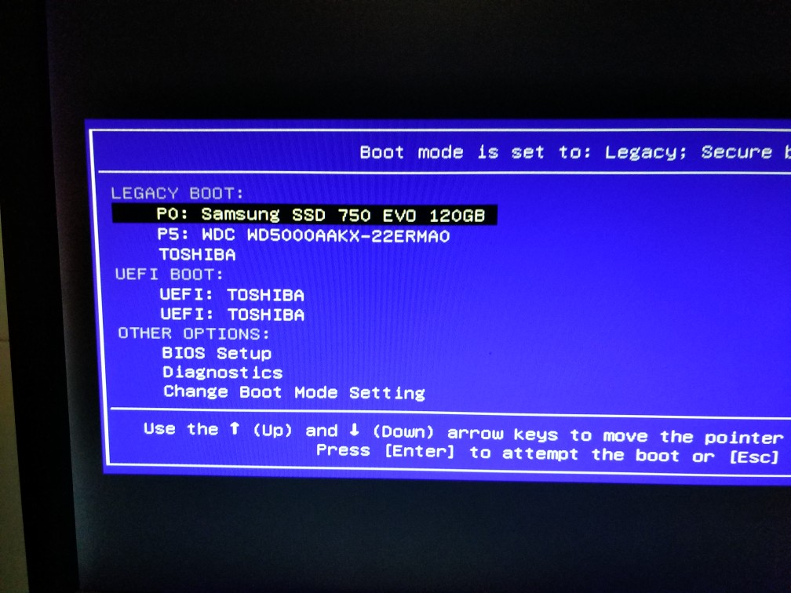

# Arch Linux 安装指南

> 本文从 2022 年 3 月 25 日开始编写，随着时间的推移，部分内容可能需要修改。请注意辨别！

本文的目的是让一个**没有任何 Linux 基础的小白**照着这篇文章一台在一台**已安装 Windows 的 UEFI 引导的 x86_64 的计算机上安装上 Arch Linux 和 Windows 双系统并使其处于基本可用的状态**。所以，和 Arch Wiki 的不同，本文追求**让用户照着文档敲指令就能装好**。所以，本文的语言会有些啰嗦，有经验的用户可以按照**省流助手**的提示进行操作

> 用户在安装过程中产生的任何数据、财产损失都与我（即本文作者无关！）

# Before Installation

这部分的内容较为枯燥，但是**强烈建议**将其读完！

## 我需要做什么？

- 你需要对 Linux，或者说计算机科学感兴趣  
  （要是没兴趣也不会来看这篇文章了吧 XD）

- 你需要解决问题和学习的能力  
  使用 Linux，不可避免的会遇到大量的、意料之外的问题。解决问题的能力就格外重要。  
  此处推荐一本书 [提问的智慧](https://github.com/ryanhanwu/How-To-Ask-Questions-The-Smart-Way)  
  我想说：使用搜索引擎、描述问题都是极为重要的能力。使用 Linux 的过程就是不断地解决问题的能力。你所学到的远不只是 Linux。

- 你需要阅读一些英语文档的能力  
   互联网是全世界的。中文文档的数量是有限的。当你遇到问题需要解决时，常常会遇到英语的内容。所以，阅读英语文档的能力是必须的。（当然，使用翻译工具也是种办法。不过，专业的名词的识别率一般较低，所以并不推荐）

- 一个 U 盘  
  U 盘里可以安装[Ventoy]()，其允许你将多个 ISO 和文件共存，我建议在这个 U 盘里放置：一个 PE，一个 Linux Live CD（带桌面环境的最好）这样，当你把电脑折腾坏了，你还可以通过 U 盘来尝试拯救你的电脑。

## 牛逼，开整！

来，给他整个活！  
走，忽略！

# 准备工作

在这一章节，你将学到：

1. 使用正确的网站下载最新的 Arch Linux 的 ISO
2. 什么是镜像站
3. 如何将 U 盘制作成一个启动盘
4. 如何把 Linux Live CD 通过 U 盘启动

> 省流助手：去[上交大镜像站](https://mirrors.sjtug.sjtu.edu.cn/archlinux/iso/latest/)下载最新的 ISO，然后刻录进 U 盘，再通过 U 盘启动

## 获取 ISO

首先，你需要下载 Arch Linux 的 ISO（安装镜像）如果你曾经安装过 Windows，那你对 ISO 肯定不会陌生。此处不多介绍。

Arch Linux 是一个滚动发行版，因此，每个月都会发布一个新的 ISO,请务必要根据这篇文章下载**最新的 ISO**！

首先，Arch Linux 的官方下载地址是在[这里](https://archlinux.org/download/)。你可以尝试通过这个链接下载。不过，由于地理位置的原因，速度极慢。

所以，为了解决这一问题，人们提出了镜像站的概念——即，将某一个仓库作为上游，镜像站每隔一段时间将其同步至自己的服务器，使用户获得更好的使用体验。
我将使用[上海交通大学的镜像站](https://mirrors.sjtug.sjtu.edu.cn)来进行演示。当然，你也可以选择别的镜像站，比如[清华 TUNA](https://mirrors.tuna.tsinghua.edu.cn)或者[中科大 USTC](https://mirrors.ustc.edu.cn)。不过，我感觉上交大的镜像站体验最好，速度最快。

所以，在浏览器中打开[下载地址](https://mirrors.sjtug.sjtu.edu.cn/archlinux/iso/latest)后，应该看到这样的画面：

直接点击那个最大的 ISO,然后就开始下载了。

> 课后习题（雾）：为什么我打开同样的链接，却看到了`archlinux-2022.04.01-x86_64.iso`或`archlinux-2022.05.01-x86_64.iso`呢？  
> 如果无法找到答案，可以尝试搜索，或重新阅读本文章

## 刻录进 U 盘

刻录进 U 盘的方案有很多，此处推荐一个我最近使用的——[Ventoy](https://www.ventoy.net/cn/index.html)。此处使用[山东大学镜像站](https://mirrors.sdu.edu.cn/)来下载这一工具。

在浏览器中打开[山东大学镜像站提供的下载链接](https://mirrors.sdu.edu.cn/github-release/ventoy_Ventoy/)，你应该看到如下的画面：
点进去，然后找到 Windows 版的 zip,下载。下载好后，解压，按照提示，给你的 U 盘安装上`Ventoy`，这一步骤较为简单，不再赘述

> 如果你这一步都完成不了的话，放弃吧，Linux 不适合你。

在 Ventoy 安装成功后，你就可以往 U 盘里放 Arch Linux 的 ISO 了。这一步就算完成啦！

> 你可以选择使用一些`old school`的方式来获得更好的稳定性，比如`Rufus`等传统的刻录工具。不过，我并不建议这种办法。

好了！到这一步就已经做好大多数的准备工作了……吗？你还需要给你的硬盘分区。我建议你在 Windows 上就做好这一工作。具体方法请自行搜索并按照自己的需求和实际情况操作。

好了，差不多可以了！现在，关闭你的电脑吧！然后，再把它打开。在开机时，狂按你的电脑的开机启动项键。对于不同品牌的笔记本和台式机来说，开机启动项应该是：

在狂按对应的按键之后，应该进入一个长这样的界面。

找到你的 U 盘，用键盘的方向键控制，然后按回车就行！
