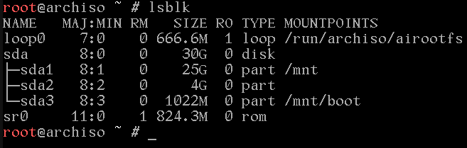

# Arch Linux 安装指南
# 作者累了，不想写了！别看了！
> 本文从 2022 年 3 月 25 日开始编写，随着时间的推移，部分内容可能需要修改。请注意辨别！

本文的目的是让一个**没有任何 Linux 基础的小白**照着这篇文章一台在一台**已安装 Windows 的 UEFI 引导的 x86_64 的计算机上安装上 Arch Linux 和 Windows 双系统并使其处于基本可用的状态**。所以，和 Arch Wiki 的不同，本文追求**让用户照着文档敲指令就能装好**。所以，本文的语言会有些啰嗦，有经验的用户可以按照**省流助手**的提示进行操作

安装 Arch Linux 可能需要几十分钟，甚至数个小时的时间（视熟练水平和网速而定，目前世界纪录是 1 分 14 秒，普通人需要大概半小时的时间）。请为自己留好充足的时间

> 用户在安装过程中产生的任何数据、财产损失都与我（即本文作者无关！）

# Before Installation

这部分的内容较为枯燥，但是**强烈建议**将其读完！

## 我需要做什么？

- **你需要对 Linux，或者说计算机科学感兴趣**
  （要是没兴趣也不会来看这篇文章了吧 XD）

- **你需要解决问题和学习的能力**
  使用 Linux，不可避免的会遇到大量的、意料之外的问题。解决问题的能力就格外重要。
  此处推荐一本书 [提问的智慧](https://github.com/ryanhanwu/How-To-Ask-Questions-The-Smart-Way)
  我想说：使用搜索引擎、描述问题都是极为重要的能力。使用 Linux 的过程就是不断地解决问题的能力。你所学到的远不只是 Linux。

- **你需要阅读一些英语文档的能力**
  互联网是全世界的。中文文档的数量是有限的。当你遇到问题需要解决时，常常会遇到英语的内容。所以，阅读英语文档的能力是必须的。（当然，使用翻译工具也是种办法。不过，专业的名词的识别率一般较低，所以并不推荐）

- **一个 U 盘**
  U 盘里可以安装[Ventoy]()，其允许你将多个 ISO 和文件共存，我建议在这个 U 盘里放置：一个 PE，一个 Linux Live CD（带桌面环境的最好）这样，当你把电脑折腾坏了，你还可以通过 U 盘来尝试拯救你的电脑。

## 牛逼，开整！

来，给他整个活！
走，忽略！

# 准备工作

在这一章节，你将学到：

1. 使用正确的网站下载最新的 Arch Linux 的 ISO
2. 什么是镜像站
3. 如何将 U 盘制作成一个启动盘
4. 如何把 Linux Live CD 通过 U 盘启动

> 省流助手：去[上交大镜像站](https://mirrors.sjtug.sjtu.edu.cn/archlinux/iso/latest/)下载最新的 ISO，然后刻录进 U 盘，再通过 U 盘启动

## 获取 ISO

首先，你需要下载 Arch Linux 的 ISO（安装镜像）如果你曾经安装过 Windows，那你对 ISO 肯定不会陌生。此处不多介绍。

Arch Linux 是一个滚动发行版，因此，每个月都会发布一个新的 ISO,请务必要根据这篇文章下载**最新的 ISO**！

首先，Arch Linux 的官方下载地址是在[这里](https://archlinux.org/download/)。你可以尝试通过这个链接下载。不过，由于地理位置的原因，速度极慢。

所以，为了解决这一问题，人们提出了镜像站的概念——即，将某一个仓库作为上游，镜像站每隔一段时间将其同步至自己的服务器，使用户获得更好的使用体验。
我将使用[上海交通大学的镜像站](https://mirrors.sjtug.sjtu.edu.cn)来进行演示。当然，你也可以选择别的镜像站，比如[清华 TUNA](https://mirrors.tuna.tsinghua.edu.cn)或者[中科大 USTC](https://mirrors.ustc.edu.cn)。不过，我感觉上交大的镜像站体验最好，速度最快。

所以，在浏览器中打开[下载地址](https://mirrors.sjtug.sjtu.edu.cn/archlinux/iso/latest)后，应该看到这样的画面：


直接点击那个最大的 ISO,然后就开始下载了。

> 课后习题（雾）：为什么我打开同样的链接，却看到了`archlinux-2022.04.01-x86_64.iso`或`archlinux-2022.05.01-x86_64.iso`呢？
> 如果无法找到答案，可以尝试搜索，或重新阅读本文章

## 刻录进 U 盘

刻录进 U 盘的方案有很多，此处推荐一个我最近使用的——[Ventoy](https://www.ventoy.net/cn/index.html)。此处使用[山东大学镜像站](https://mirrors.sdu.edu.cn/)来下载这一工具。

在浏览器中打开[山东大学镜像站提供的下载链接](https://mirrors.sdu.edu.cn/github-release/ventoy_Ventoy/)，你应该看到如下的画面：
点进去，然后找到 Windows 版的 zip,下载。下载好后，解压，按照提示，给你的 U 盘安装上`Ventoy`，这一步骤较为简单，不再赘述

> 如果你这一步都完成不了的话，放弃吧，Linux 不适合你。

在 Ventoy 安装成功后，你就可以往 U 盘里放 Arch Linux 的 ISO 了。这一步就算完成啦！

> 你可以选择使用一些`old school`的方式来获得更好的稳定性，比如`Rufus`等传统的刻录工具。不过，我并不建议这种办法。

好了！到这一步就已经做好大多数的准备工作了……吗？你还需要给你的硬盘分区。

> 你只需要分配一个分区用于存放整个系统便可以了（个人建议，大于 50G 就可以了！）

我建议你在 Windows 上就做好这一工作。具体方法请自行搜索并按照自己的需求和实际情况操作。

好了，差不多可以了！现在，关闭你的电脑吧！然后，再把它打开。在开机时，狂按你的电脑的开机启动项键。对于不同品牌的笔记本和台式机来说，开机启动项应该是：


在狂按对应的按键之后，应该进入一个长这样的界面。

找到你的 U 盘，用键盘的方向键控制，然后按回车就行！


然后你就会看到这么个东西。这个时候，用键盘上的方向键将光标移动到后面有`Copy to RAM`的这一行，然后按回车！
恭喜你！你现在已经进入 Arch Linux Live CD 了！
你的电脑会黑屏一段时间，然后出现一堆文字，这是正常的

> 如果你的电脑内存小于 4GB,请不要选择这个选项，直接选择默认的选项，按回车即可。另外，
> 如果你的电脑内存小于 4GB，建议把电脑丢了= =

# 安装过程


等待一会之后，你应该看到这么一个大黑框。

> 接下来，你会面对这个大黑框输几十行命令，如果你觉得很难，建议立刻关闭本教程，去安装 Manjaro= =

## 改字体

默认的字体又丑又小，不能忍！
输入

```shell
setfont /usr/share/kbd/consolefonts/LatGrkCyr-12x22.psfu.gz
```

然后，爽！


## 联网

如果你使用有线网络连接，那你应该不需要配置就能够正常使用。
如果你使用无线网卡（USB 接口的无线网卡不能用！），请使用`iwctl`来配置。
先输入

```
iwctl
```

然后会进入一个 iwd 的控制台
在这里，输入：

```
station wlan0 connect [你们家wifi名称]
```

> 我建议在输入`station`之后按`Tab`自动补全。另外，wifi 名称不可以是**中文！**

输入这行命令后，再输入`exit`，然后就应该又可以看到上文中的红色的终端了

做完这步，可以通过`ping baidu.com`来测试是否连上了网。如果一切正常，输出应该像这样：

你可以`ctrl+c`强行停止。注意，对于任何 Linux 的进程来说，都可以用`ctrl+c`来强制停止。

## 挂载分区

首先，你应该早在 Windows 上就分好了区。

Linux 的文件结构和 Windows 上的文件结构是完全不一样的。在 Linux 当中，根目录（`/`），就是整个系统的放置的地点。所以，和 windows 不同，linux 下一切的文件和分区都可以看作文件夹和文件。这些`文件夹`，都需要挂载在根目录下。
比如说，`mnt`，他的完整路径就应该是`/mnt`

> 简单的例子，你有一个衣架，那么衣架就是根目录，你在衣架上挂了一件衣服，挂在了衣架的最上方，这件衣服就是硬盘的分区，挂载点就是`衣架上方`，衣服的路径应该是`衣架/上方`

首先，输入`lsblk`查看你的硬盘分区。在我的电脑上，我的硬盘分区大概长这样：

可以看到，我的电脑连接了三块硬盘，但是我们只需要`sda`这一块。

> 在你的电脑上，`sda`可能不叫`sda`，可能是`sdb`或者是`nvme0n1`，不用在意。你自己 happy 就行

首先，先格式化你的分区为`ext4`格式。这是 Linux 下最流行的一个文件系统。

```shell
mkfs.ext4 /dev/sda1
```

然后，挂载这个分区到/mnt

```shell
mount /dev/sda1 /mnt
```

> `/dev/sda1`可以是你需要的分区。你可以通过`lsblk`并且通过查看分区大小来确定你需要安装在哪个分区上

在挂载好/mnt 分区后，你还需要挂载上 efi 分区。如果你已经装上了 windows 系统，那么 windows 会自动帮你分出一块 100MB 的 EFI 分区。你可以通过`lsblk`的结果来确定是哪一块。
假设这 EFI 分区是`/dev/sda2`,那么输入：

```
mkdir /mnt/boot
mount /dev/sda2 /mnt/boot
```

> 挂载硬盘的顺序不能乱！必须先挂载`/mnt`再挂载`/mnt/boot`

正确的输出应该如下：


完成这一切后，再次输入`lsblk`来查看磁盘各个分区的挂载点是否正常


可以看到，现在在右侧的`mountpoints`一栏已经出现了`/mnt`和`/mnt/boot`

Done!

## 安装软件包

在完成上述的操作之后，你就应该开始安装软件包了。首先，要介绍一个重要的概念`包管理器(Package Manager)`。`Linux`下，万物皆包。小到字体，图标，大到系统内核，都是以包的形式呈现的。`包管理器`可以帮助用户解决包的安装，卸载，管理等操作。各个`Linux发行版`的包管理器各不相同，包的后缀也不同。`Arch Linux`的包管理器叫`pacman`(同吃豆人游戏)。

包管理器负责从`软件仓库`下载包，并对其进行安装，卸载等操作。不同的包之间存在依赖，冲突的关系，包管理器就负责对这些特殊情况进行处理。具体可以查看[Arch Wiki 对于 pacman 的介绍](<https://wiki.archlinux.org/title/Pacman_(%E7%AE%80%E4%BD%93%E4%B8%AD%E6%96%87)>)

在上文中，我们提到——`包管理器从软件仓库下载包`，那么，软件仓库的列表被存储在系统中的某个配置文件当中。我们需要通过配置仓库的源的方式来获得更好的体验。

```bash
systemctl stop reflector
echo 随便什么东西 > /etc/pacman.d/mirrorlist
```

上述的命令中，我们将系统自行配置的软件源列表都删掉了。现在，我们可以开始自行配置了。  
你需要使用一个`文本编辑器`来编辑配置文件。在这里，我推荐使用`nano`，因为其简洁，门槛低，并且，你现在可以直接使用。当然，你也可以尝试使用`vim`，如果你觉得你的智商足够高的话 ：）

```bash
nano /etc/pacman.d/mirrorlist
```

应该长这样:


这里的 hello,就是你刚刚随便输入的东西，不用管他，删掉就可以了。然后，你需要写入:`Server=https://mirrors.ustc.edu.cn/archlinux/$repo/os/$arch`

> 在这里，我选择了[USTC 的镜像源](https://mirrors.ustc.edu.cn)


